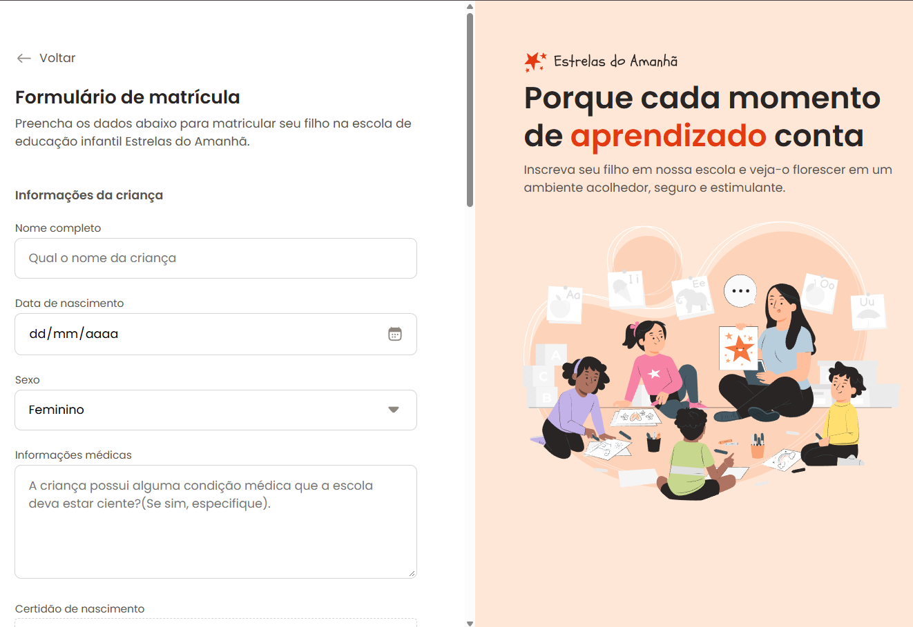

Formulário de Matrícula

Projeto desenvolvido durante os estudos da Rocketseat com foco em HTML e CSS.

Demonstração

link: https://henriquemagno.github.io/formulario-de-matricula/

Preview

Tecnologias

HTML
CSS Nesting

O que aprendi:

- Estruturação semântica com HTML
- Flexbox
- Grid Layout
- Organização de formulários
- Estados de inputs
- Organização de CSS3

Objetivo

Praticar a construção de formulários modernos utilizando apenas HTML e CSS, aplicando boas práticas de organização e estilização.
